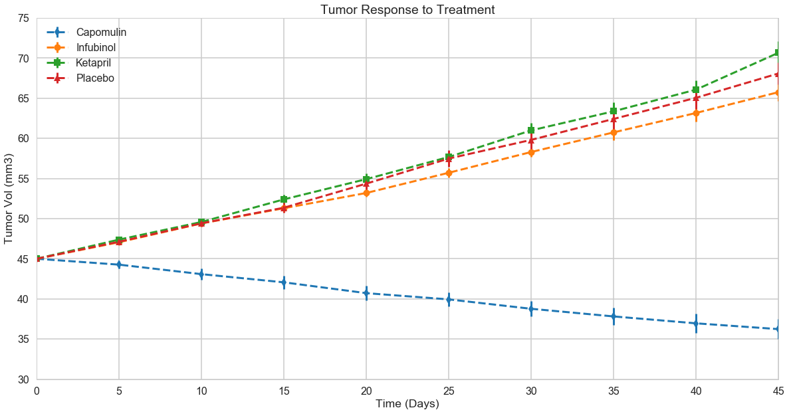
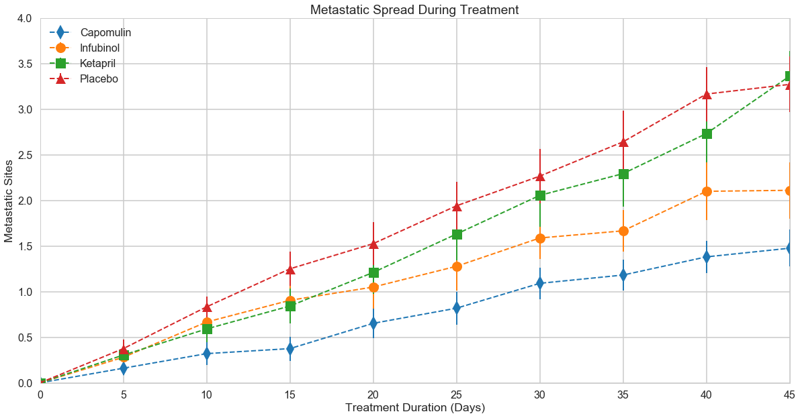
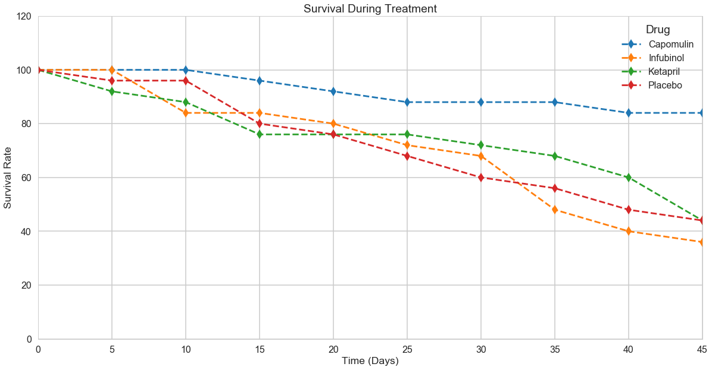
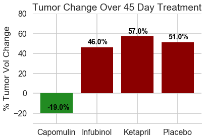

Analysis:

1) Capomulin has an effect on decreasing tumor volume size over the treatment period, while Infubinol and Ketapril have similar tumor volume responses to the placebo. 

2) Capomulin has a significant effect on slowing metastatic spread, while Infubinol has minor effect on slowing metastatic spread. Ketapril has similar metastatic spread response to the placebo.

3) Capomulin has higher mice survival after 45 days than placebo, while Infubinol and Ketapril have similar mice survival rates to the placebo.


```
#import dependencies and raw data csv files
import pandas as pd
import matplotlib.pyplot as plt
import seaborn as sns
import numpy as np

data1 = pd.read_csv("mouse_drug_data.csv")
data2 = pd.read_csv("clinicaltrial_data.csv")

#Merge tables
data = pd.merge(data1,data2, on="Mouse ID")
data.head()
```


<div>
<style>
    .dataframe thead tr:only-child th {
        text-align: right;
    }

    .dataframe thead th {
        text-align: left;
    }

    .dataframe tbody tr th {
        vertical-align: top;
    }
</style>
<table border="1" class="dataframe">
  <thead>
    <tr style="text-align: right;">
      <th></th>
      <th>Mouse ID</th>
      <th>Drug</th>
      <th>Timepoint</th>
      <th>Tumor Volume (mm3)</th>
      <th>Metastatic Sites</th>
    </tr>
  </thead>
  <tbody>
    <tr>
      <th>0</th>
      <td>f234</td>
      <td>Stelasyn</td>
      <td>0</td>
      <td>45.000000</td>
      <td>0</td>
    </tr>
    <tr>
      <th>1</th>
      <td>f234</td>
      <td>Stelasyn</td>
      <td>5</td>
      <td>47.313491</td>
      <td>0</td>
    </tr>
    <tr>
      <th>2</th>
      <td>f234</td>
      <td>Stelasyn</td>
      <td>10</td>
      <td>47.904324</td>
      <td>0</td>
    </tr>
    <tr>
      <th>3</th>
      <td>f234</td>
      <td>Stelasyn</td>
      <td>15</td>
      <td>48.735197</td>
      <td>1</td>
    </tr>
    <tr>
      <th>4</th>
      <td>f234</td>
      <td>Stelasyn</td>
      <td>20</td>
      <td>51.112713</td>
      <td>2</td>
    </tr>
  </tbody>
</table>
</div>


```
## Seaborn for set style and set context
sns.set_style("whitegrid")
sns.set_context("poster")

```


```
## GENERATE STANDARD ERROR TABLES FOR EVERY TREATEMENT(TUMOR VOL AND META SITES)

#get list of drugs
drug_list = data['Drug'].unique()
time_list = data['Timepoint'].unique()
#create dictionary to store standard error values for each drug/timepoint
tumor_error ={}
tumor_error['Timepoint'] = time_list
meta_error = {}
meta_error['Timepoint'] = time_list

#loop through data to filter by drug name
for drug in drug_list:
    temp = data.loc[(data['Drug'] == drug)]
    drug_tumor_error = []
    drug_meta_error = []
    #loop through drug data to filter by timepoint
    for time in time_list:
        temp2 = temp.loc[(temp['Timepoint'] == time)]
        #get standard error for each timepoint
        tumor_sem = temp2['Tumor Volume (mm3)'].sem()
        meta_sem = temp2['Metastatic Sites'].sem()
        #store standard error values in dictionary
        drug_tumor_error.append(tumor_sem)
        drug_meta_error.append(meta_sem)
    #save list of standard error
    tumor_error[f'{drug}'] = drug_tumor_error  
    meta_error[f'{drug}'] = drug_meta_error
#turn into dataframe
re_tumor_error = pd.DataFrame(tumor_error).set_index('Timepoint')
re_meta_error = pd.DataFrame(meta_error).set_index('Timepoint')

#Table for standard error of tumor volume
re_tumor_error
```


<div>
<style>
    .dataframe thead tr:only-child th {
        text-align: right;
    }

    .dataframe thead th {
        text-align: left;
    }

    .dataframe tbody tr th {
        vertical-align: top;
    }
</style>
<table border="1" class="dataframe">
  <thead>
    <tr style="text-align: right;">
      <th></th>
      <th>Capomulin</th>
      <th>Ceftamin</th>
      <th>Infubinol</th>
      <th>Ketapril</th>
      <th>Naftisol</th>
      <th>Placebo</th>
      <th>Propriva</th>
      <th>Ramicane</th>
      <th>Stelasyn</th>
      <th>Zoniferol</th>
    </tr>
    <tr>
      <th>Timepoint</th>
      <th></th>
      <th></th>
      <th></th>
      <th></th>
      <th></th>
      <th></th>
      <th></th>
      <th></th>
      <th></th>
      <th></th>
    </tr>
  </thead>
  <tbody>
    <tr>
      <th>0</th>
      <td>0.000000</td>
      <td>0.000000</td>
      <td>0.000000</td>
      <td>0.000000</td>
      <td>0.000000</td>
      <td>0.000000</td>
      <td>0.000000</td>
      <td>0.000000</td>
      <td>0.000000</td>
      <td>0.000000</td>
    </tr>
    <tr>
      <th>5</th>
      <td>0.448593</td>
      <td>0.164505</td>
      <td>0.235102</td>
      <td>0.264819</td>
      <td>0.202385</td>
      <td>0.218091</td>
      <td>0.231708</td>
      <td>0.482955</td>
      <td>0.239862</td>
      <td>0.188950</td>
    </tr>
    <tr>
      <th>10</th>
      <td>0.702684</td>
      <td>0.236144</td>
      <td>0.282346</td>
      <td>0.357421</td>
      <td>0.319415</td>
      <td>0.402064</td>
      <td>0.376195</td>
      <td>0.720225</td>
      <td>0.433678</td>
      <td>0.263949</td>
    </tr>
    <tr>
      <th>15</th>
      <td>0.838617</td>
      <td>0.332053</td>
      <td>0.357705</td>
      <td>0.580268</td>
      <td>0.444378</td>
      <td>0.614461</td>
      <td>0.466109</td>
      <td>0.770432</td>
      <td>0.493261</td>
      <td>0.370544</td>
    </tr>
    <tr>
      <th>20</th>
      <td>0.909731</td>
      <td>0.359482</td>
      <td>0.476210</td>
      <td>0.726484</td>
      <td>0.595260</td>
      <td>0.839609</td>
      <td>0.555181</td>
      <td>0.786199</td>
      <td>0.621889</td>
      <td>0.533182</td>
    </tr>
    <tr>
      <th>25</th>
      <td>0.881642</td>
      <td>0.439356</td>
      <td>0.550315</td>
      <td>0.755413</td>
      <td>0.813706</td>
      <td>1.034872</td>
      <td>0.577401</td>
      <td>0.746991</td>
      <td>0.741922</td>
      <td>0.602513</td>
    </tr>
    <tr>
      <th>30</th>
      <td>0.934460</td>
      <td>0.490620</td>
      <td>0.631061</td>
      <td>0.934121</td>
      <td>0.975496</td>
      <td>1.218231</td>
      <td>0.746045</td>
      <td>0.864906</td>
      <td>0.899548</td>
      <td>0.800043</td>
    </tr>
    <tr>
      <th>35</th>
      <td>1.052241</td>
      <td>0.692248</td>
      <td>0.984155</td>
      <td>1.127867</td>
      <td>1.013769</td>
      <td>1.287481</td>
      <td>1.084929</td>
      <td>0.967433</td>
      <td>1.003186</td>
      <td>0.881426</td>
    </tr>
    <tr>
      <th>40</th>
      <td>1.223608</td>
      <td>0.708505</td>
      <td>1.055220</td>
      <td>1.158449</td>
      <td>1.118567</td>
      <td>1.370634</td>
      <td>1.564779</td>
      <td>1.128445</td>
      <td>1.410435</td>
      <td>0.998515</td>
    </tr>
    <tr>
      <th>45</th>
      <td>1.223977</td>
      <td>0.902358</td>
      <td>1.144427</td>
      <td>1.453186</td>
      <td>1.416363</td>
      <td>1.351726</td>
      <td>1.888586</td>
      <td>1.226805</td>
      <td>1.576556</td>
      <td>1.003576</td>
    </tr>
  </tbody>
</table>
</div>


```
#Table for standard error of metastatic sites
re_meta_error.head()
```


<div>
<style>
    .dataframe thead tr:only-child th {
        text-align: right;
    }

    .dataframe thead th {
        text-align: left;
    }

    .dataframe tbody tr th {
        vertical-align: top;
    }
</style>
<table border="1" class="dataframe">
  <thead>
    <tr style="text-align: right;">
      <th></th>
      <th>Capomulin</th>
      <th>Ceftamin</th>
      <th>Infubinol</th>
      <th>Ketapril</th>
      <th>Naftisol</th>
      <th>Placebo</th>
      <th>Propriva</th>
      <th>Ramicane</th>
      <th>Stelasyn</th>
      <th>Zoniferol</th>
    </tr>
    <tr>
      <th>Timepoint</th>
      <th></th>
      <th></th>
      <th></th>
      <th></th>
      <th></th>
      <th></th>
      <th></th>
      <th></th>
      <th></th>
      <th></th>
    </tr>
  </thead>
  <tbody>
    <tr>
      <th>0</th>
      <td>0.000000</td>
      <td>0.000000</td>
      <td>0.000000</td>
      <td>0.000000</td>
      <td>0.000000</td>
      <td>0.000000</td>
      <td>0.000000</td>
      <td>0.000000</td>
      <td>0.000000</td>
      <td>0.000000</td>
    </tr>
    <tr>
      <th>5</th>
      <td>0.074833</td>
      <td>0.108588</td>
      <td>0.091652</td>
      <td>0.098100</td>
      <td>0.093618</td>
      <td>0.100947</td>
      <td>0.095219</td>
      <td>0.066332</td>
      <td>0.087178</td>
      <td>0.077709</td>
    </tr>
    <tr>
      <th>10</th>
      <td>0.125433</td>
      <td>0.152177</td>
      <td>0.159364</td>
      <td>0.142018</td>
      <td>0.163577</td>
      <td>0.115261</td>
      <td>0.105690</td>
      <td>0.090289</td>
      <td>0.123672</td>
      <td>0.109109</td>
    </tr>
    <tr>
      <th>15</th>
      <td>0.132048</td>
      <td>0.180625</td>
      <td>0.194015</td>
      <td>0.191381</td>
      <td>0.158651</td>
      <td>0.190221</td>
      <td>0.136377</td>
      <td>0.115261</td>
      <td>0.153439</td>
      <td>0.111677</td>
    </tr>
    <tr>
      <th>20</th>
      <td>0.161621</td>
      <td>0.241034</td>
      <td>0.234801</td>
      <td>0.236680</td>
      <td>0.181731</td>
      <td>0.234064</td>
      <td>0.171499</td>
      <td>0.119430</td>
      <td>0.200905</td>
      <td>0.166378</td>
    </tr>
  </tbody>
</table>
</div>


```
##GENERATE TABLE FOR MEAN TUMOR VOLUME CHANGE BY TREATMENT

#Group data to get mean values for tumor error
data_group = data.groupby(['Drug', 'Timepoint'])
tumor_vol = pd.DataFrame(data_group['Tumor Volume (mm3)'].mean()).reset_index(inplace=False)
#Table for mean values for tumor volume
re_tumor_vol = tumor_vol.pivot(index='Timepoint', columns='Drug', values='Tumor Volume (mm3)')
re_tumor_vol

```


<div>
<style>
    .dataframe thead tr:only-child th {
        text-align: right;
    }

    .dataframe thead th {
        text-align: left;
    }

    .dataframe tbody tr th {
        vertical-align: top;
    }
</style>
<table border="1" class="dataframe">
  <thead>
    <tr style="text-align: right;">
      <th>Drug</th>
      <th>Capomulin</th>
      <th>Ceftamin</th>
      <th>Infubinol</th>
      <th>Ketapril</th>
      <th>Naftisol</th>
      <th>Placebo</th>
      <th>Propriva</th>
      <th>Ramicane</th>
      <th>Stelasyn</th>
      <th>Zoniferol</th>
    </tr>
    <tr>
      <th>Timepoint</th>
      <th></th>
      <th></th>
      <th></th>
      <th></th>
      <th></th>
      <th></th>
      <th></th>
      <th></th>
      <th></th>
      <th></th>
    </tr>
  </thead>
  <tbody>
    <tr>
      <th>0</th>
      <td>45.000000</td>
      <td>45.000000</td>
      <td>45.000000</td>
      <td>45.000000</td>
      <td>45.000000</td>
      <td>45.000000</td>
      <td>45.000000</td>
      <td>45.000000</td>
      <td>45.000000</td>
      <td>45.000000</td>
    </tr>
    <tr>
      <th>5</th>
      <td>44.266086</td>
      <td>46.503051</td>
      <td>47.062001</td>
      <td>47.389175</td>
      <td>46.796098</td>
      <td>47.125589</td>
      <td>47.248967</td>
      <td>43.944859</td>
      <td>47.527452</td>
      <td>46.851818</td>
    </tr>
    <tr>
      <th>10</th>
      <td>43.084291</td>
      <td>48.285125</td>
      <td>49.403909</td>
      <td>49.582269</td>
      <td>48.694210</td>
      <td>49.423329</td>
      <td>49.101541</td>
      <td>42.531957</td>
      <td>49.463844</td>
      <td>48.689881</td>
    </tr>
    <tr>
      <th>15</th>
      <td>42.064317</td>
      <td>50.094055</td>
      <td>51.296397</td>
      <td>52.399974</td>
      <td>50.933018</td>
      <td>51.359742</td>
      <td>51.067318</td>
      <td>41.495061</td>
      <td>51.529409</td>
      <td>50.779059</td>
    </tr>
    <tr>
      <th>20</th>
      <td>40.716325</td>
      <td>52.157049</td>
      <td>53.197691</td>
      <td>54.920935</td>
      <td>53.644087</td>
      <td>54.364417</td>
      <td>53.346737</td>
      <td>40.238325</td>
      <td>54.067395</td>
      <td>53.170334</td>
    </tr>
    <tr>
      <th>25</th>
      <td>39.939528</td>
      <td>54.287674</td>
      <td>55.715252</td>
      <td>57.678982</td>
      <td>56.731968</td>
      <td>57.482574</td>
      <td>55.504138</td>
      <td>38.974300</td>
      <td>56.166123</td>
      <td>55.432935</td>
    </tr>
    <tr>
      <th>30</th>
      <td>38.769339</td>
      <td>56.769517</td>
      <td>58.299397</td>
      <td>60.994507</td>
      <td>59.559509</td>
      <td>59.809063</td>
      <td>58.196374</td>
      <td>38.703137</td>
      <td>59.826738</td>
      <td>57.713531</td>
    </tr>
    <tr>
      <th>35</th>
      <td>37.816839</td>
      <td>58.827548</td>
      <td>60.742461</td>
      <td>63.371686</td>
      <td>62.685087</td>
      <td>62.420615</td>
      <td>60.350199</td>
      <td>37.451996</td>
      <td>62.440699</td>
      <td>60.089372</td>
    </tr>
    <tr>
      <th>40</th>
      <td>36.958001</td>
      <td>61.467895</td>
      <td>63.162824</td>
      <td>66.068580</td>
      <td>65.600754</td>
      <td>65.052675</td>
      <td>63.045537</td>
      <td>36.574081</td>
      <td>65.356386</td>
      <td>62.916692</td>
    </tr>
    <tr>
      <th>45</th>
      <td>36.236114</td>
      <td>64.132421</td>
      <td>65.755562</td>
      <td>70.662958</td>
      <td>69.265506</td>
      <td>68.084082</td>
      <td>66.258529</td>
      <td>34.955595</td>
      <td>68.438310</td>
      <td>65.960888</td>
    </tr>
  </tbody>
</table>
</div>


```
# tumor_plot = re_tumor_vol.plot(kind='line', figsize=(20,10), title='Tumor Response to Treatment', 
#                       marker ='d', linestyle='dashed')
# plt.xlabel("Time (Days)")
# plt.ylabel("Tumor Vol (mm3)")
# plt.ylim(20,80)
# plt.show()
```


```
final_list = ['Capomulin', 'Infubinol', 'Ketapril', 'Placebo']
marker_list = ['d','o','s','^']

##PLOT TUMOR RESPONSE TO TREATMENT
i=0
plt.figure(figsize=(20,10))
for drug in final_list:
    plt.errorbar(re_tumor_error.index, re_tumor_vol[drug],re_tumor_error[drug],
                 ls='dashed', 
                 elinewidth=3,
                 lw=3, 
                 ms=10,
                 marker= marker_list[i])
    i=i+1
plt.legend(loc='best')
plt.title('Tumor Response to Treatment')    
plt.xlabel("Time (Days)")
plt.ylabel("Tumor Vol (mm3)")
plt.ylim(30,75)
plt.xlim(0,45)
plt.show()
```





```
##GENERATE TABLE FOR MEAN METASTATIC SITES CHANGE BY TREATMENT

#Group data to get mean values for metastatic sites
meta_sites = pd.DataFrame(data_group['Metastatic Sites'].mean()).reset_index(inplace=False)
#Table for mean values of metastatic sites
re_meta_sites = meta_sites.pivot(index='Timepoint', columns='Drug', values='Metastatic Sites')
re_meta_sites
```


<div>
<style>
    .dataframe thead tr:only-child th {
        text-align: right;
    }

    .dataframe thead th {
        text-align: left;
    }

    .dataframe tbody tr th {
        vertical-align: top;
    }
</style>
<table border="1" class="dataframe">
  <thead>
    <tr style="text-align: right;">
      <th>Drug</th>
      <th>Capomulin</th>
      <th>Ceftamin</th>
      <th>Infubinol</th>
      <th>Ketapril</th>
      <th>Naftisol</th>
      <th>Placebo</th>
      <th>Propriva</th>
      <th>Ramicane</th>
      <th>Stelasyn</th>
      <th>Zoniferol</th>
    </tr>
    <tr>
      <th>Timepoint</th>
      <th></th>
      <th></th>
      <th></th>
      <th></th>
      <th></th>
      <th></th>
      <th></th>
      <th></th>
      <th></th>
      <th></th>
    </tr>
  </thead>
  <tbody>
    <tr>
      <th>0</th>
      <td>0.000000</td>
      <td>0.000000</td>
      <td>0.000000</td>
      <td>0.000000</td>
      <td>0.000000</td>
      <td>0.000000</td>
      <td>0.000000</td>
      <td>0.000000</td>
      <td>0.000000</td>
      <td>0.000000</td>
    </tr>
    <tr>
      <th>5</th>
      <td>0.160000</td>
      <td>0.380952</td>
      <td>0.280000</td>
      <td>0.304348</td>
      <td>0.260870</td>
      <td>0.375000</td>
      <td>0.320000</td>
      <td>0.120000</td>
      <td>0.240000</td>
      <td>0.166667</td>
    </tr>
    <tr>
      <th>10</th>
      <td>0.320000</td>
      <td>0.600000</td>
      <td>0.666667</td>
      <td>0.590909</td>
      <td>0.523810</td>
      <td>0.833333</td>
      <td>0.565217</td>
      <td>0.250000</td>
      <td>0.478261</td>
      <td>0.500000</td>
    </tr>
    <tr>
      <th>15</th>
      <td>0.375000</td>
      <td>0.789474</td>
      <td>0.904762</td>
      <td>0.842105</td>
      <td>0.857143</td>
      <td>1.250000</td>
      <td>0.764706</td>
      <td>0.333333</td>
      <td>0.782609</td>
      <td>0.809524</td>
    </tr>
    <tr>
      <th>20</th>
      <td>0.652174</td>
      <td>1.111111</td>
      <td>1.050000</td>
      <td>1.210526</td>
      <td>1.150000</td>
      <td>1.526316</td>
      <td>1.000000</td>
      <td>0.347826</td>
      <td>0.952381</td>
      <td>1.294118</td>
    </tr>
    <tr>
      <th>25</th>
      <td>0.818182</td>
      <td>1.500000</td>
      <td>1.277778</td>
      <td>1.631579</td>
      <td>1.500000</td>
      <td>1.941176</td>
      <td>1.357143</td>
      <td>0.652174</td>
      <td>1.157895</td>
      <td>1.687500</td>
    </tr>
    <tr>
      <th>30</th>
      <td>1.090909</td>
      <td>1.937500</td>
      <td>1.588235</td>
      <td>2.055556</td>
      <td>2.066667</td>
      <td>2.266667</td>
      <td>1.615385</td>
      <td>0.782609</td>
      <td>1.388889</td>
      <td>1.933333</td>
    </tr>
    <tr>
      <th>35</th>
      <td>1.181818</td>
      <td>2.071429</td>
      <td>1.666667</td>
      <td>2.294118</td>
      <td>2.266667</td>
      <td>2.642857</td>
      <td>2.300000</td>
      <td>0.952381</td>
      <td>1.562500</td>
      <td>2.285714</td>
    </tr>
    <tr>
      <th>40</th>
      <td>1.380952</td>
      <td>2.357143</td>
      <td>2.100000</td>
      <td>2.733333</td>
      <td>2.466667</td>
      <td>3.166667</td>
      <td>2.777778</td>
      <td>1.100000</td>
      <td>1.583333</td>
      <td>2.785714</td>
    </tr>
    <tr>
      <th>45</th>
      <td>1.476190</td>
      <td>2.692308</td>
      <td>2.111111</td>
      <td>3.363636</td>
      <td>2.538462</td>
      <td>3.272727</td>
      <td>2.571429</td>
      <td>1.250000</td>
      <td>1.727273</td>
      <td>3.071429</td>
    </tr>
  </tbody>
</table>
</div>


```
##PLOT METASTATIC SPREAD DURING TREATMENT
i=0
plt.figure(figsize=(20,10))
for drug in final_list:
    plt.errorbar(re_meta_error.index, re_meta_sites[drug],re_meta_error[drug],
                 ls='dashed', 
                 elinewidth=2,
                 lw=2, 
                 ms=15,
                 marker=marker_list[i])
    i=i+1
plt.legend(loc='best')
plt.title('Metastatic Spread During Treatment')    
plt.xlabel("Treatment Duration (Days)")
plt.ylabel("Metastatic Sites")
plt.ylim(0,4.0)
plt.xlim(0,45)
plt.show()
```





```
##GENERATE TABLE FOR SURVIVING MICE BY TREATMENT

#Grouped data to get count of surviving mice for each drug and timepoint
survival_group = data.groupby(['Drug', 'Timepoint']).count()
survival_group = survival_group.rename(columns={'Mouse ID':'Mouse Count'}).reset_index(inplace=False)
#Table for percent of surviving mice for each drug and timepoint
survival_count = survival_group.pivot(index='Timepoint', columns='Drug', values='Mouse Count')
survival_perc = (survival_count/survival_count.loc[0])*100
survival_perc = survival_perc[final_list]
survival_perc
```


<div>
<style>
    .dataframe thead tr:only-child th {
        text-align: right;
    }

    .dataframe thead th {
        text-align: left;
    }

    .dataframe tbody tr th {
        vertical-align: top;
    }
</style>
<table border="1" class="dataframe">
  <thead>
    <tr style="text-align: right;">
      <th>Drug</th>
      <th>Capomulin</th>
      <th>Infubinol</th>
      <th>Ketapril</th>
      <th>Placebo</th>
    </tr>
    <tr>
      <th>Timepoint</th>
      <th></th>
      <th></th>
      <th></th>
      <th></th>
    </tr>
  </thead>
  <tbody>
    <tr>
      <th>0</th>
      <td>100.0</td>
      <td>100.0</td>
      <td>100.0</td>
      <td>100.0</td>
    </tr>
    <tr>
      <th>5</th>
      <td>100.0</td>
      <td>100.0</td>
      <td>92.0</td>
      <td>96.0</td>
    </tr>
    <tr>
      <th>10</th>
      <td>100.0</td>
      <td>84.0</td>
      <td>88.0</td>
      <td>96.0</td>
    </tr>
    <tr>
      <th>15</th>
      <td>96.0</td>
      <td>84.0</td>
      <td>76.0</td>
      <td>80.0</td>
    </tr>
    <tr>
      <th>20</th>
      <td>92.0</td>
      <td>80.0</td>
      <td>76.0</td>
      <td>76.0</td>
    </tr>
    <tr>
      <th>25</th>
      <td>88.0</td>
      <td>72.0</td>
      <td>76.0</td>
      <td>68.0</td>
    </tr>
    <tr>
      <th>30</th>
      <td>88.0</td>
      <td>68.0</td>
      <td>72.0</td>
      <td>60.0</td>
    </tr>
    <tr>
      <th>35</th>
      <td>88.0</td>
      <td>48.0</td>
      <td>68.0</td>
      <td>56.0</td>
    </tr>
    <tr>
      <th>40</th>
      <td>84.0</td>
      <td>40.0</td>
      <td>60.0</td>
      <td>48.0</td>
    </tr>
    <tr>
      <th>45</th>
      <td>84.0</td>
      <td>36.0</td>
      <td>44.0</td>
      <td>44.0</td>
    </tr>
  </tbody>
</table>
</div>


```
##PLOT SURVIVAL DURING TREATMENT
survival_plot = survival_perc.plot(kind='line', figsize=(20,10), title='Survival During Treatment', 
                      marker ='d', linestyle='dashed')
    
plt.xlabel("Time (Days)")
plt.ylabel("Survival Rate")
plt.ylim(0,120)
plt.xlim(0,45)
plt.show()
```





```
##GENERATE TABLE FOR MEAN TUMOR VOLUME CHANGE BY TREATMENT

summary = (re_tumor_vol.loc[45][final_list] - re_tumor_vol.loc[0][final_list])*100/re_tumor_vol.loc[0][final_list]
summary = pd.DataFrame(summary).reset_index(inplace=False).rename(columns={0:'% Tumor Vol Change'})
summary
```


<div>
<style>
    .dataframe thead tr:only-child th {
        text-align: right;
    }

    .dataframe thead th {
        text-align: left;
    }

    .dataframe tbody tr th {
        vertical-align: top;
    }
</style>
<table border="1" class="dataframe">
  <thead>
    <tr style="text-align: right;">
      <th></th>
      <th>Drug</th>
      <th>% Tumor Vol Change</th>
    </tr>
  </thead>
  <tbody>
    <tr>
      <th>0</th>
      <td>Capomulin</td>
      <td>-19.475303</td>
    </tr>
    <tr>
      <th>1</th>
      <td>Infubinol</td>
      <td>46.123472</td>
    </tr>
    <tr>
      <th>2</th>
      <td>Ketapril</td>
      <td>57.028795</td>
    </tr>
    <tr>
      <th>3</th>
      <td>Placebo</td>
      <td>51.297960</td>
    </tr>
  </tbody>
</table>
</div>


```
##GENERATE BAR GRAPH FOR TUMOR CHANGE OVER TREATMENT PERIOD

#create lists with values to input into bar graph
drugz = []
tumor_change = []
x_axis = []
for index in summary.index:
    drugz.append(summary.iloc[index]['Drug'])
    tumor_change.append(summary.iloc[index]['% Tumor Vol Change'])
    x_axis.append(index)
```


```
#plot bar graph and adjust asthetics to add values and labels
summary_plot = plt.bar(x_axis, tumor_change, color='darkred')
plt.title('Tumor Change Over 45 Day Treatment')
plt.ylabel('% Tumor Vol Change')
plt.ylim(-30,80)
plt.xticks(x_axis, drugz)
summary_plot[0].set_color('forestgreen')
for i, v in enumerate(tumor_change):
    plt.text(i-.23, v+3, f'{round(v)}%', color='black', fontsize=14,fontweight='bold')
sns.despine(left=True, top=True, right=True)
plt.show()

```




